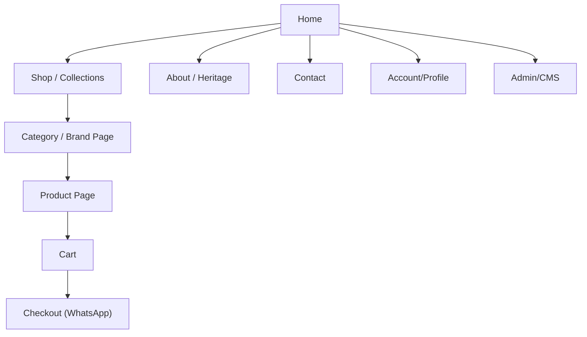
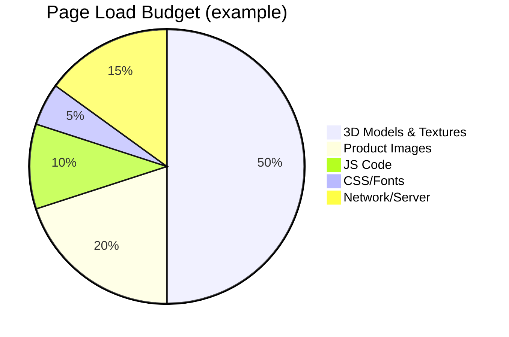

# Executive Summary  
Modern luxury watch e-commerce sites blend minimalism with rich visuals. Key competitors (Chrono24, Cartier, TAG Heuer, COS, etc.) favour neutral palettes, generous whitespace and product-focused layouts. The site should tell a craftsmanship story (heritage, 360° views), offer intuitive globalized UX (multi-currency, clear CTAs), and include subtle interactivity (animations, micro-interactions) that delight without clutter. 

We propose renaming **“Mr Sadik”** to something like **“Maison Sadique”**, which evokes French luxury-house connotations (maison = house, Sadique as a stylized form of Sadik). This hints at heritage and exclusivity (similar to fashion maisons) while playing on the client’s name. Another option is **“Sadiq & Co.”**, echoing established jewelry/watch brands (e.g. Cartier, de Grisogono). The chosen name should match the elegant brand story we build.  

On the technical side, the stack is solid: Django (monolithic or REST APIs) on the backend, Cloudinary for image/3D asset storage and transformation, and a high-performance SQL database. We compare **TiDB** (a distributed MySQL-compatible DB) vs **Neon** (serverless Postgres) vs vanilla **PostgreSQL**. TiDB excels at automatic horizontal scaling and HA (zero-data-loss failover), while PostgreSQL (including Neon) provides a mature ecosystem of extensions. Neon adds auto-scaling compute/storage for Postgres, enabling zero-downtime branching and scale-to-zero. For most mid-market stores, PostgreSQL (or Neon) is simpler; choose TiDB only if we anticipate massive scale or cross-region analytics needs.

Security, CI/CD, and monitoring will follow industry best practices: enforce HTTPS, use Django’s authentication features (hashed passwords, CSRF tokens), PCI compliance for payment data (even though payments occur via WhatsApp), and automated tests/linters in CI. Integrate with a real-time error tracker (e.g. Sentry) and performance monitoring (Datadog/New Relic) post-launch. For accessibility and SEO, we will use semantic HTML, alt text for all images, clear headings, ARIA roles and keyboard nav; these also boost SEO via better crawlability and UX.

Overall, the project breaks into these workstreams: brand design, UI/UX design (wireframes to high-fi), 3D asset creation, frontend implementation (HTML/CSS/JS + 3D viewer), backend development (models, API, admin), payments integration (WhatsApp API), testing/optimization, and deployment. The roadmap below prioritizes core e-commerce first (catalog, PDP, cart) then advanced features (3D viewer, animations, SEO tweaks). Each milestone notes effort and risks.

# Brand and Competitive Analysis  
**Brand Name:** We suggest **“Maison Sadique”** for a haute-couture feel. (“Maison” implies Parisian luxury house; “Sadique” is a French spelling of Sadik, lending elegance). It aligns with industry naming trends (e.g. *Maison Balmain*, *Atelier Munro*) and suggests tradition. An alternative is **“Sadiq & Co.”**, which echoes venerable jewellers (e.g. Cartier & Co.) and suggests a family atelier.  

**Competitive Review (Top ~8 sites):** Leading luxury watch e-tailers (Chrono24, Watchfinder, COS, TAG Heuer, Omega Shop, Cartier (W&W microsite), Nacre, MAEN, etc.) share these traits:
- **Visual richness:** Big, high-res product photos and videos (often 360° or 3D) highlight fine details. E.g. Cartier’s *Watches & Wonders* site uses interactive 3D environments to immerse the user in the watch’s design story.  
- **Minimalist UI:** Neutral color schemes (black/white/grey) with one accent tone (gold/bronze). Sparse navbars and plenty of whitespace keep focus on products. COS’s site is cited for “neutral colour palette with functional typography” and “clear, structured product grids”. Standout features often include *limited distractions* – only essential menus and minimal text.  
- **Typography:** Elegant serifs (e.g. **Playfair Display**, **Cormorant Garamond**, **Bodoni Moda**) or crisp sans-serifs (e.g. **Roboto**, **Inter**, **Tenor Sans**). Use a serif for headlines and a clean sans for body text. This mix conveys luxury (serif tradition) yet keeps content readable.  
- **Navigation/UX:** Intuitive categorization (by brand, collection, new, sale), prominent search, and clear CTAs like “Explore Collection” or “Book a View”. Sticky or hamburger nav for mobile. Faceted filtering on listing pages (by brand, material, price, etc.) is common. Trust signals are visible: e.g. “2-year warranty”, press logos, and secure checkout badges.  
- **3D/AR features:** Ahead-of-curve sites offer a 3D model viewer or AR try-on. This can be emulated by embedding glTF/GLB models (via `<model-viewer>` or three.js) in the PDP. Chrono24 (marketplace) is a UX leader, but watch brands like **TAG Heuer** and **Tissot** also have clean PDPs (huge product image, key specs, add-to-cart). **Emulate:** high-res zoomable images, quick view carousels, stock/status (in stock/preorder). **Avoid:** busy backgrounds, autoplay sound, overly flashy effects (distract), and overly lengthy content that slows UX. 

**UX Patterns:**  
- **Homepage:** A hero section with an elegant lifestyle shot or video (brand story), followed by featured collections or best sellers, and a visual “About Us/Heritage” snippet. Include trust cues (reviews, press).  
- **Collections / Category:** Grid of product cards (hover states to reveal alternate views or quick “Add” button). Filters in a sidebar/toolbar.  Emphasize product images over text. Use paginated or infinite scroll judiciously (Baymard says avoid infinite scroll for discoverability on desktop).  
- **Product Detail (PDP):** Primary area for 3D/360° viewer and high-res gallery. Show watch at multiple angles and allow click-to-zoom. Prominent SKU, name, price, materials. Short “Story” blurb emphasizing craftsmanship. “Add to Cart” and optional “Enquire via WhatsApp” buttons. Microinteractions: e.g. a subtle color change or icon animation when adding to cart.  
- **Cart:** Clean summary of items (thumbnail, name, qty, price). Editable quantities. “Remove” icon is clear. Order total fixed at bottom. CTA to “Checkout via WhatsApp”.  
- **Checkout (WhatsApp API):** Instead of a multi-page form, this flow sends the order to WhatsApp. On Cart page, user clicks “Checkout with WhatsApp”. A templated summary message (order, shipping info) is sent via the WhatsApp Business API. The site can also display a confirmation page or prompt to continue chat.  
- **Account:** User registration/login with email (or “Login with WhatsApp OTP” for frictionless mobile sign-in). Dashboard with order history (linked to chats). “Manage Address”.  
- **CMS/Admin:** Use Django’s admin or a lightweight headless CMS for content blocks (brand story, press releases). Admin interfaces to add/edit products (images via Cloudinary), manage inventory, and review orders.  

 *Luxury sites often emphasize product interactivity. For example, Cartier’s watch site uses a cinematic 3D view of the Santos watch to immerse visitors in the design story.*  

# UI/UX Design  
**Layout & Navigation:** Follow minimalist principles: a fixed header with just logo and key links (Shop, About, Contact, Account) and a hamburger icon on mobile. Use dropdown or mega-menu if many categories, but keep it clean and text-light. Bread-crumbs on product pages aid orientation. A “sticky” add-to-cart or price bar on scroll can help mobile UX.

**Typography & Color:** A refined palette might be: **Black (#000000)**, **White (#FFFFFF)**, **Slate Grey (#4A4A4A)**, and a **Champagne Gold (#BFA380)** accent (for buttons or hover). Alternatively a deep navy or charcoal in place of black adds warmth. Use only 2–3 typefaces. For example, headings in *Playfair Display* or *Bodoni Moda* (Google Fonts) for a “high-fashion” feel, and body text in *Roboto* or *Inter* for readability. Use consistent font sizes (e.g. H1 ~48px, H2 ~32px on desktop) with ample line-height. See examples: COS uses a “neutral palette and functional typography”.  

**Color Palette (examples):**  
- Primary: black `#000000` and white `#FFFFFF` (for text and backgrounds)  
- Secondary: light grey `#F5F5F5` (backgrounds) and charcoal `#333333` (text)  
- Accent: gold `#BFA380` (buttons, links, highlights) or a dark navy `#0F1B27`.  

**Accessibility:** Use semantic HTML (H1–H6, `<nav>`, `<main>`, `<button>`). Ensure text contrasts meet WCAG AA (e.g. dark grey on off-white is OK, avoid light grey text on white). Include `alt` text on all images (e.g. “Close-up of gold chronograph watch with brown strap”). Label form fields and buttons clearly. Provide keyboard focus styles (e.g. outline on focus) and “Skip to content” links. The site must *please assistive tech* to reach all content.  

**SEO:** Each page gets unique `<title>` and meta description. Products use structured data (JSON-LD **Product** schema with name, brand, price, availability). Use clean URLs (e.g. `/collection/chronograph-watches/`, `/product/sadiq-rose-gold-watch`). Lazy-load offscreen images and 3D models with `loading=lazy` or JS observers. Keep page speed high by inlining critical CSS, minimizing JS, and serving images/WebGL assets via Cloudinary’s CDN (auto-optimize on upload). Provide a `/sitemap.xml` and `/robots.txt`. Use headings (`<h2>`, `<h3>`) to break content – this helps both accessibility and SEO (search engines understand content hierarchy).  

# Site Structure & Components  
**Sitemap (Mermaid):**  


**Pages/Components:** (summarized responsibilities)
| Page/Component         | Responsibilities                                                  |
|------------------------|-------------------------------------------------------------------|
| **Home**               | Brand intro banner, featured collections or promos, value props.  |
| **Collections/Category** | List of products in a category (grid), with filters/sort.      |
| **Product Detail (PDP)** | Gallery of images/3D viewer; specs (movement, case, strap); price; add-to-cart; “Buy on WhatsApp” callout. |
| **Cart**               | Show cart items (image, name, price, qty); update quantities; CTA to “Checkout via WhatsApp”. |
| **Checkout (WhatsApp)** | Initiate WhatsApp message via API with order summary.           |
| **Account**            | User login/registration; order history; profile details.          |
| **About/Brand**        | Brand story, craftsmanship, press logos.                          |
| **Contact**            | Contact form, support info, possibly store locator.              |
| **Admin/CMS**          | Django admin for managing products, orders, content blocks.      |
| **3D Viewer**          | A component (e.g. `<model-viewer>` or custom Three.js canvas) to rotate/zoom the watch model on PDP. |
| **Animations/Microinteractions** | Button hover states, loading spinners, add-to-cart effects (e.g. icon bounce), as per motion specs below. |

# Visual & Interaction Design  
**Animations & Motion:** Use motion sparingly to convey polish and feedback. For instance, when the user hovers a product card, fade in a secondary image and a subtle “+” add icon with a 200–250ms ease-out transition:  
```css
.product-card img { transition: transform 200ms ease-out; }
.product-card:hover img { transform: scale(1.02); }
```
Add-to-cart confirmation can “pop” a cart icon or badge:  
```css
.cart-badge { animation: pop 300ms ease-out; }
@keyframes pop {
  0% { transform: scale(0.5); opacity: 0; }
  100% { transform: scale(1); opacity: 1; }
}
```
For more complex scene transitions (like revealing a modal), use ~200–300ms durations. Avoid >400ms for standard transitions (users notice lag). Use easing curves: common ones are `ease-out` for elements entering view (slows gently) and `ease-in-out` for emphasizing motion symmetry. Here’s a Three.js tween example (assuming use of a tweening library):  
```js
// Rotate watch model on user click
new TWEEN.Tween(watch.rotation)
  .to({ y: watch.rotation.y + Math.PI }, 600)
  .easing(TWEEN.Easing.Cubic.Out)
  .start();
```
Above, rotation over 600ms with an ease-out curve makes a smooth spin. Always respect `prefers-reduced-motion` to disable non-essential animations.

**Microinteractions:** Small feedback loops improve UX. For example, disable the “Add to Cart” button briefly after click and show a checkmark. Or animate a heart icon for “favorite”. A hover tooltip on filters, or a brief slide-in snackbar “Item added” are delightful touches. Keep them fast (~100–200ms) so they feel instantaneous.

# 3D Models & WebGL Integration  
**Asset Creation Pipeline:** Model each watch in a 3D tool (Blender, Maya or CAD software). Use a clean, low-to-medium polygon count: high-detail watch parts (gears, screws) but optimized (target ~50k poly max for full-detail model). Bake textures: use **PBR materials** (metalness/roughness workflow). Export textures (albedo, normal, metalness, roughness maps) at reasonable resolution (1K or 2K max for premium products). Export models to **glTF 2.0 (.glb)**, which is widely supported and compact. Use Draco mesh compression to further reduce size (3D WebGL performance best practice).  
Generate multiple LODs (Levels of Detail): one full-detail, plus 2–3 simplified versions (e.g. 5k–10k and 1k polys) using automated tools (Blender decimate, or Simplygon/InstaLOD). The client browser should load the low-LOD first, then replace with higher LOD when ready. This ensures quick interactive startup on all devices. Name files like `WatchModel_LOD0.glb`, `WatchModel_LOD1.glb`, etc., and use glTF’s MSFT_lod extension for auto-switching if supported. Also create a narrow, environment reflection map (HDRI) or set up scene lighting carefully so the shiny metal looks realistic.

**3D Viewer Library:** Two main approaches: a full JS framework or a lightweight viewer.  
- **<model-viewer>**: Google’s web component is easiest. With HTML you write `<model-viewer src="watch.glb" ar enable-zoom></model-viewer>`, and it handles rotation, zoom, and AR. It auto-adds orbit controls and UI for mobile AR. Good for most use-cases.  
- **Three.js**: Offers the most flexibility (custom controls, shaders). It’s popular and has a large community. Good if you want custom scene effects (e.g. background blur, parallax camera). It’s slightly more complex to set up.  
- **Babylon.js**: Another powerful engine, more game-oriented (with built-in physics, collisions, particle systems). It has a rich editor but is heavier. For a product viewer, Three.js is usually sufficient and lighter-weight. (SitePoint notes Three.js is simpler for general 3D on the web, while Babylon has advanced game features.)  

**Performance Budgets:** Aim to keep **First Contentful Paint** <1s and total page weight under ~1–2 MB on mobile. For 3D pages, target the model (GLB) + textures <1MB if possible (using compression and LODs). Use lazy-loading: defer loading non-critical 3D viewers until viewport or interaction (via IntersectionObserver). For example, only load a watch’s 3D model when its card scrolls into view or user clicks “View 3D”. This ensures minimal blocking of initial rendering. Leverage Cloudinary’s automatic webp/compressed images for photos. (A pie-chart “performance budget” might allocate ~50% to 3D models, 30% to 2D images, 10% scripts, 10% CSS.)  



# AI-Assisted Development Prompts  
Use generative AI to bootstrap assets and code. Example prompts:  
- **3D Model:** “Create a low-polygon 3D model of a men’s wristwatch in Blender style: round black leather strap, rose gold case, intricate dial with Roman numerals. Export optimized for real-time (low faces) in glTF/GLB format.”  
- **Texture:** “Generate a seamless PBR texture (base color, metalness, roughness maps) for brushed stainless steel (neutral gray) and for black grained leather strap. 2048×2048 px.”  
- **Product Copy:** “Write a 100-word luxury product description for a men’s rose-gold chronograph watch called ‘Sadiq Heritage’, highlighting craftsmanship and exclusivity.”  
- **Django Models (AI-assisted coding):** “Provide Django model definitions for Product and Order. Product fields: name, SKU, price, description, stock (integer), image (URL). Order fields: user (FK to auth.User), product (FK), quantity, total_price, status.”  
- **Other Code:** “Generate a React/JS snippet that embeds a `<model-viewer>` with src bound to a product’s 3D model URL and adds a 360° rotation on load.”  

Integrate AI into dev workflow: use GitHub Copilot or chat assistants for boilerplate code (forms, serializers) and initial content drafts, then refine manually.  

# Backend Architecture  

```mermaid
flowchart LR
  A[User Browser] --> B[Django Web App]
  B --> C[(Neon/Postgres DB)]
  B --> D[Cloudinary Storage]
  B --> E[WhatsApp Business API]
  B --> F[Email Service]
  A --> G[CDN (Static Files)]
  B --> G
```
**Explanation:** The Django backend handles HTTP requests and API calls. It connects to a **PostgreSQL/Neon** database (for products, users, orders) and stores media (images, GLB) on **Cloudinary** (via signed uploads). The app uses Django REST Framework (or GraphQL) to serve JSON to the frontend. For payments, the app uses the **WhatsApp Business API** (either via Meta’s Cloud API or Twilio) to send messages to customers. Static assets (CSS/JS from Django templates) and CDN-served images speed up load.   

**Database Schema (example):**  
```python
# products/models.py
class Product(models.Model):
    name = models.CharField(max_length=200)
    sku = models.CharField(max_length=50, unique=True)
    description = models.TextField()
    price = models.DecimalField(max_digits=10, decimal_places=2)
    stock = models.IntegerField()
    image_url = models.URLField()
    model_3d_url = models.URLField()  # link to Cloudinary 3D asset

class Order(models.Model):
    user = models.ForeignKey(User, on_delete=models.CASCADE)
    products = models.ManyToManyField(Product, through='OrderItem')
    total_price = models.DecimalField(max_digits=10, decimal_places=2)
    status = models.CharField(max_length=20, default='pending')
    created_at = models.DateTimeField(auto_now_add=True)

class OrderItem(models.Model):
    order = models.ForeignKey(Order, on_delete=models.CASCADE)
    product = models.ForeignKey(Product, on_delete=models.CASCADE)
    quantity = models.IntegerField()
    price = models.DecimalField(max_digits=10, decimal_places=2)
```
Other tables: **SKU** table (if variants), **Inventory** (if multi-warehouse), **UserProfile**, **Cart/Session**.  

**Database Trade-offs:** The TiDB-vs-Postgres decision largely depends on scale. For most stores, a single-server PostgreSQL (or Neon) suffices and offers a rich ecosystem. Neon (serverless Postgres) decouples compute (scales up as needed) and provides branching for dev/test. TiDB (MySQL dialect) is preferable only if we expect extremely high traffic or need built-in HA/analytics on fresh data. Below is a quick comparison:

| Criterion              | TiDB (Distributed SQL)                      | Neon (Serverless Postgres)             | PostgreSQL (Self-Hosted)            |
|------------------------|---------------------------------------------|----------------------------------------|-------------------------------------|
| **Scaling**            | Horizontal (add nodes, no manual sharding) | Compute auto-scale; storage separates | Vertical (scale-up); read replicas possible |
| **Availability**       | Raft consensus, auto failover (zero data loss) | High (redundant storage engine)        | Requires extra tools (Patroni, replicas) |
| **Ecosystem**          | MySQL-compatible (limited extensions)      | Full Postgres (can use PG extensions)  | Full Postgres, rich extensions      |
| **Analytics**          | TiFlash for HTAP (real-time OLAP on live data) | Add tools as needed (e.g. Timescale)   | Use separate OLAP or Citus if needed |
| **Cost**               | Open-source; TiDB Cloud (free tier, pay-as-you-go) | Free tier; pay for compute usage       | Self-host free; managed DB cost by provider |
| **Best for**           | Multi-region scale-out, large OLTP+OLAP    | SaaS with burst traffic, dev/test branching | SMB & growing e-commerce stores     |

## Media Handling & Cloudinary  
Images and 3D models are uploaded to Cloudinary. Django can use [**django-cloudinary-storage**](https://github.com/cloudinary/cloudinary_storage) for seamless integration. Upload widgets or APIs send files to Cloudinary and store the returned URL in the product model. Cloudinary can auto-generate optimized variants (webp, resized) on-the-fly (using URL params). Use signed uploads (security). For example, an image URL might be `https://res.cloudinary.com/.../w_1000,h_1000,f_auto,q_auto/v123/watch.jpg`. The 3D GLB can also be stored here and served with optimal caching.

## WhatsApp Integration  
We’ll use the **WhatsApp Business API** (via a provider like Twilio or Meta’s official API). During checkout, the backend creates a *templated message* summarizing the order (product names, qty, price, total, shipping info) and sends it to the user’s WhatsApp number using the API. Alternatively, a “Click to Chat” link can open a pre-filled WhatsApp chat on mobile. The customer then can confirm/purchase in chat or via a payment link. This model avoids card processing on-site but be mindful: it’s less seamless than Stripe. For a luxury UX, we’d ensure this flow is clear (e.g. “You will receive a WhatsApp message to complete payment securely” on confirmation).  

Key steps: 
1. Apply for a verified WhatsApp Business account.
2. Generate message templates (for order confirmation) and get them approved by WhatsApp. 
3. In Django, use an HTTP client to call the WhatsApp API endpoint with the user’s number and template parameters. 
4. Handle API responses and log the chat reference.  
According to industry sources, “WhatsApp commerce features let customers add items to a cart and complete purchases within chat”. We will leverage that by integrating the official API and ensuring GDPR compliance for opt-ins.

## Security & Deployment  
- **CI/CD:** Use GitHub Actions or GitLab CI to run tests (pytest, flake8) on push. Build Docker images for Django, run migrations and collectstatic, then deploy to a cloud service (AWS/GCP/Azure, or DigitalOcean). Use Docker/Kubernetes if scale warrants.  
- **HTTPS & Data Protection:** Enforce SSL. Store secrets (DB credentials, Cloudinary keys, WhatsApp API keys) in environment vars or secret manager. Use Django’s built-in protections (CSRF tokens on forms). For any stored PII (user addresses, phone numbers), ensure database is encrypted at rest (managed DBs do this by default). Comply with GDPR/CCPA: include a privacy policy, allow users to erase data, etc.  
- **Monitoring:** Set up real-time error tracking (Sentry) and performance logging (New Relic, Google Lighthouse CI in pipeline). For uptime, use health checks.  

# Accessibility & SEO Best Practices  
Making the site accessible also improves SEO. Use headings in logical order (H1 on homepage = “Welcome to Maison Sadique”), alt text on all images (e.g. product image: `alt="Men’s rose gold luxury wristwatch with black strap"`). Ensure all buttons/links have discernible text, and form labels are explicit. Implement keyboard focus styles so users can tab through “Add to Cart”, quantity fields, etc. For SEO: use clean HTML5, proper use of meta tags, and include structured data (schema.org/Product for each PDP) to get rich snippets (price, rating). Pre-render or server-render critical content so crawlers see it (Django does SSR by default). Provide multilingual or currency selector if targeting global markets (with proper `<link hreflang>`).

# Implementation Roadmap  

| Milestone                 | Description                                    | Effort  | Risk  |
|---------------------------|------------------------------------------------|--------|-------|
| **Brand & Design Setup**  | Finalize name/logo, moodboard, color palette, fonts. Create style guide. | Low    | Low   |
| **UX/UI Wireframes**      | Design key page wireframes (Home, PDP, Cart). Get client feedback. | Medium | Medium (scope creep) |
| **Frontend Structure**    | Set up Django project structure, base templates, static bundling. | Medium | Low   |
| **Backend Models/API**    | Implement models (Product, Order, User), admin interface, REST endpoints. | Medium | Medium (schema changes) |
| **Cloudinary Integration**| Configure media storage; migrate existing images to Cloudinary. | Low    | Low   |
| **Basic Pages**           | Build Home, Collections, PDP, Cart pages (no 3D yet). | Medium | Low   |
| **WhatsApp Checkout**     | Integrate WhatsApp API; develop checkout flow. | Medium | High (API complexity) |
| **3D Models & Viewer**    | Create 3D assets; embed using `<model-viewer>` or Three.js. | High   | High (performance, dev) |
| **Animations & UI Polish**| Add CSS/JS animations, microinteractions, responsive tweaks. | Medium | Medium |
| **SEO & Accessibility**   | Implement semantic markup, meta tags, ARIA roles, alt text. Lighthouse audit. | Medium | Low   |
| **Testing & QA**         | End-to-end testing (Selenium or Cypress), performance tuning. | Medium | Medium |
| **Deployment & Monitoring**| CI/CD pipeline, deploy to cloud, set up monitoring/logging. | Low   | Low/Med |
| **Launch & Review**      | Beta launch, gather feedback, fix critical issues, optimize. | Medium | Medium |

Each task includes reviews and client sign-off. Major risks: WhatsApp API approval delay, 3D integration challenges (performance or compatibility), and scope creep on design features.

In sum, this plan ensures a **high-end, minimalistic luxury watch e-commerce** site: elegant branding, immersive 3D product displays, streamlined Django backend, and thoughtful UX that exudes exclusivity. All key sources (design analysis, 3D WebGL, UX best practices) have informed these recommendations. 

